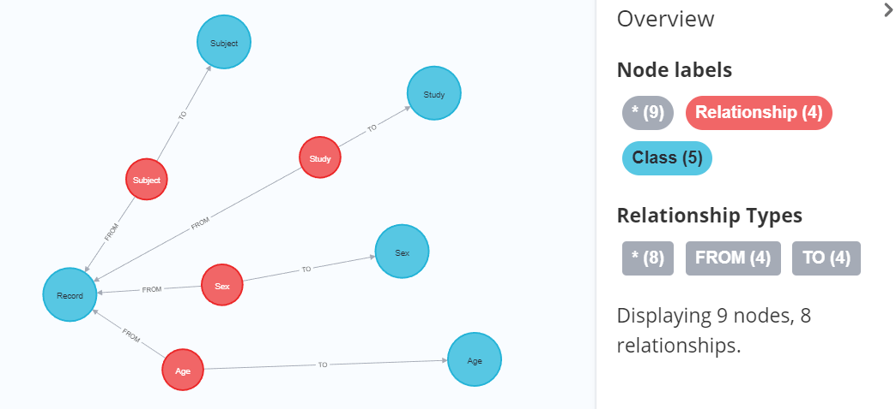

# tab2neo- backend classes
High-level Python classes to load, model and reshape tabular data imported into Neo4j database  
IMPORTANT NOTE: tested on **versions 4.3.6 and 4.4.11 of Neo4j**  
python verison: 3.8

## Installation

`pip install tab2neo`

## Modules

DATA LOADERS - modules allowing to read data from various formats and write it to neo4j
- FileDataLoader -  Load data into Neo4j, with support the following input formats: sas7bdat, xpt, rda, xls, xlsx, csv See [details](data_loaders/README.md)   

MODEL APPLIERS
- ModelApplier - Class to restructure data in Neo4j database using Class-Relationship model 
(which as well resides in Neo4j). 
See [details](model_appliers/README.md)

DATA PROVIDERS
- DataProvider - To fetch the data already in the database (in particular, the way the data after the 
transformations with ModelApplier in mode='schema_PROPERTY', or any linked data in Neo4j in mode = 'noschema')
See [details](data_providers/README.md)      

MODEL MANAGERS
- ModelManager - Class to manage metadata nodes (Class-Relationship model)
    
QUERY BUILDERS
- QueryBuilder - Class to support creation of cypher queries to work with data in Neo4j  

## End-to-end data loading and reshaping example

The example code below runs through a use case of data loader, model manager, model applier and data provider.

#### Importing the data 

The call to FileDataLoader in the code below connects to the database using environment variables for your host and log-in credentials. Alternatively you can use the format `FileDataLoader(host="bolt://...",credentials=("username","password"))` to connect. The call to clean_slate() empties the database, and then load_file reads in your data from the specified filepath. See our example data [here](examples/data/Record.csv).

```python
from model_managers import ModelManager
from data_loaders import FileDataLoader
from model_appliers import ModelApplier
from data_providers import DataProvider

fdl = FileDataLoader()
fdl.clean_slate()
fdl.load_file(
    folder='examples/data/', 
    filename='Record.csv'
)
```

Now the data will be populated within your database, but it won't be connected in a meaningful way. We have \`Source Data Column\` nodes containing information about the columns of our data - Study, Subject, Age and Sex, and \`Source Data Row\` nodes containing information of the two rows. The following code creates a trivial model(Classes and Relationships) from the data using ModelManager.

```python
mm = ModelManager()
mm.create_model_from_data()
```
Here we can see we now have class and relationship nodes, illustrating connections between Study, Subject, Age and Sex. The red nodes below indicate relationship nodes, while the blue indicate class nodes.



Now using that class-relationship model we built using ModelManager, we can refactor our data and extract entities of the defined classes into separate nodes. In the code below we use `refactor_all` to do this, and we can see in the image that age values of 40 and 50 have been extracted into their own nodes. 

```python
ma = ModelApplier()
ma.refactor_all()

```


Now we have our data set up, we can call it back in a tabular way using DataProvider. Here we call back the Subject, Record and Age classes. 

*Note: The Record class connects the graph between Subject and Age, and so is required for this call, despite not appearing in the output.*

As we have not specified any relationships, we must set `infer_rels=True`. The argument `return_propname = False` ensures that we see the label name in our output, and `return_nodeid = False` removes the id values generated for each unique node in Neo4j from your output.

```python
dp = DataProvider()
dp.get_data_generic(["Subject","Record","Age"],infer_rels=True,return_propname=False,return_nodeid=False) 
```

```
            Subject  Age 
    0            S001      30
    1            S002      40
```
    

Note: ModelManager as well allows to create addtional schema classes with the following functions, however the content of tab2neo package at this stage does not allow to populate those new classes with derived data. This functionality will become available in later releases.

We can create some additional classes using `create_class` from ModelManager:

```python
mm.create_class([
    {'label': 'Parameter', 'short_label': 'PARAM'}, 
    {'label': 'Analysis Value (C)', 'short_label': 'AVALC'}, 
    {'label': 'Analysis Value', 'short_label': 'AVAL'}, 
    {'label': 'Record', 'short_label': 'RECORD'}
    ])
```
And we can also create related classes, where for each triplet, the required classes and the relationships between them will be created:

```python
mm.create_related_classes_from_list([
    ['Subject', 'Record', 'Record'],
    ['Record', 'Parameter', 'Parameter'],
    ['Record', 'Analysis Value', 'Analysis Value'],
    ['Record', 'Analysis Value (C)', 'Analysis Value (C)'],
]
)
```
And finally we can create Term nodes using `create_ct`. Here the class with label 'Parameter' is being linked with [:HAS_CONTROLLED_TERM] relationships to 'Age' and 'Sex' Term nodes.

```python
mm.create_ct(
    {
    'Parameter': [{'rdfs:label': 'Age'}, {'rdfs:label': 'Sex'}],               
    }
)
```


## Dependencies:
- https://github.com/GSK-Biostatistics/neointerface
