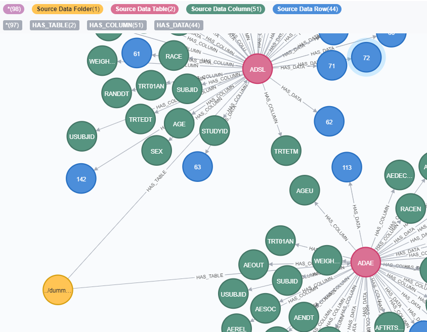

# FileDataLoader Class

FileDataLoader - Class to load data into Neo4j, with support for for the following input formats: 
rda, xpt, sas7bdat, xls, xlsx.
A goal is to harmonize loading files in those formats.

EXAMPLE ([file with more details](../examples/load_adsl_adae.py)):
```python
    from data_loaders import file_data_loader
    
    dl = file_data_loader.FileDataLoader()
    dl.clean_slate()       

    df = dl.load_file(folder="../dummy_data", filename="adsl.rda")

    df = dl.load_file(folder="../dummy_data", filename="adae.rda")
```
NOTE: The `FileDataLoader()` call makes use of environment variables for your Neo4j databse credentials. Alternatively, call them directly within your code:

```python
dl = file_data_loader.FileDataLoader(host="bolt://...",credentials=("USERNAME","PASSWORD"))
```
The ADSL data import, when *only the metadata is imported* (metadataonly==True), produces the following Neo4j nodes and relationships:


When the ADSL data is imported as well, then the following nodes (with the label `Source Data Row`) get added.

The *provenance* of the data is contained in the added attributes *_domain_* and *_folder_* , 
AS WELL AS with the creation of `HAS_DATA` relationships.


Upon full load of "ADSL" and "ADAE" (*both* metatada *and* data):



