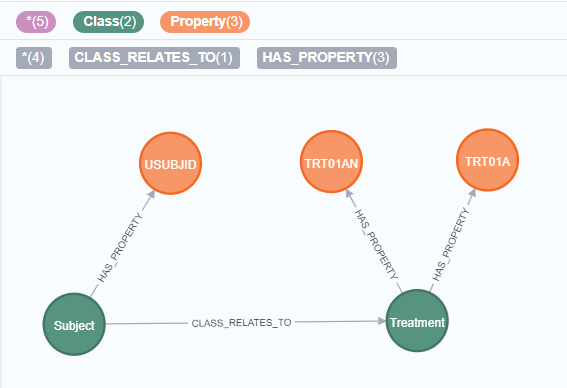
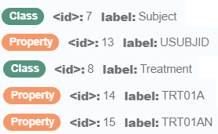
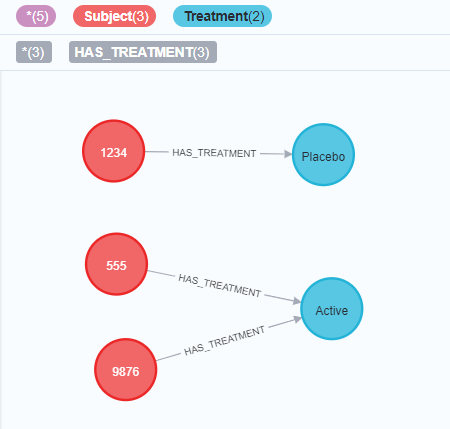
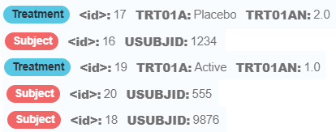
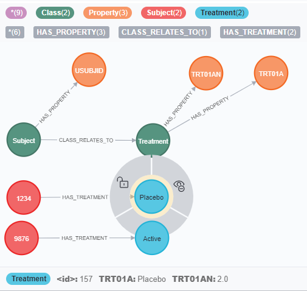
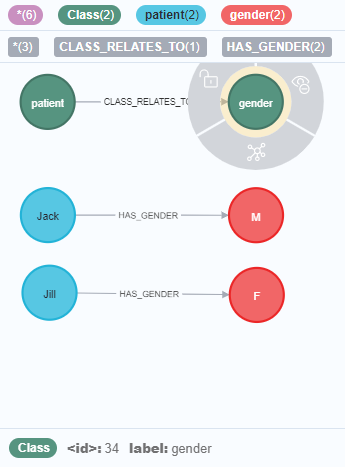

# Class DataProvider(NeoInterface):
   To use the data already in the database (such as the data after the transformations with [ModelApplier](../model_appliers/README.md)),
   for various purposes - such as to feed the User Interface.

   Also for future data transformation, data enrichment, etc.

# Quick start
Given that Neo4j database contains the following metadata nodes:  
    
    
And the following data nodes:  
  
    
a call  
   
    dp = DataProvider()
    dp.get_data(["Subject", "Treatment"]) 
    
will return a dataframe
    

      Subject.USUBJID  Subject Treatment.TRT01A  Treatment.TRT01AN  Treatment
    0            1234      122          Placebo                2.0        123
    1            9876      124           Active                1.0        125
    2             555      126           Active                1.0        127

where columns 'Subject' and 'Treatment' would contain unique identifiers of the corresponding nodes in the database (Neo4j node ids) and the rest of the columns will contain values of properties of the corresponding nodes.
    
# Detailed technical description
### __init__()
name | arguments| return
-----| ---------| -------
*__init__*| mode='schema_PROPERTY', allow_optional_classes = True, *args, **kwargs|

    :param mode:                if 'schema_PROPERTY': determines matching based on Class-Property schema \
                                if 'noschema': determines matching based on all relationships in the database
                                if 'noschema': NOTE: all the interrelationships should consistently exits for all classes
    :param allow_optional_classes   If True then classes in the list with postfix ** will be considered optional
    (OPTIONAL MATCH will be used to fetch data for those classes - see example test_get_data_noschema_optional_class )

---

## DATA RETRIEVAL

### get_data()
name | arguments| return
-----| ---------| -------
*get_data*| classes:list, where_map=None, limit = 20|pd.DataFrame

    Assembles into a Pandas dataframe the Property values from all the data nodes with the specified Classes.
    Simplified version of get_data_generic()

    :param classes:         List of strings with Class names.  EXAMPLE: ['Study', 'Site', 'Subject']
    :param where_map:       Used to restrict the data (by default, no restriction.)
                            A dictionary whose keys are Classes to apply restrictions to,
                                and whose values are dictionaries specifying conditions on Property values.
                            An implicit AND is understood among all the clauses.
                            EXAMPLE:
                            {
                                'SUBJECT': {
                                    'USUBJID': '01-001',
                                    'SUBJID': '001',
                                    'PATIENT GROUP': [3, 5]
                                },
                                'SEX': {
                                    'ASEX': 'Male'
                                }
                            }
                            Notes:
                                - The keys in the outer dictionary are expected to be node labels.
                                - The (key/values) in the inner dictionary entries
                                  are meant to be (attribute names : desired values)
                                  that are applicable to the node with their corresponding label.
                                - The values may be various data type, incl. strings, integers and lists.
    :param where_rel_map:   Used to restrict the data (by default, no restriction.)
                            A dictionary whose keys are Classes to apply restrictions to,
                                and whose values are dictionaries specifying conditions existance/non-existance 
                                of relationships to that class, depending on the setup of the dictionary.
                            EXAMPLE:
                            {
                                'Subject': {
                                    'EXISTS': {'include': ['Adverse Events']}
                                }
                            }
                            translates into a query:
                            MATCH (`Subject`:`Subject`)
                            WHERE EXISTS {MATCH (`Subject`)-[]-(x) WHERE (x:`Adverse Events`)}
                            See QueryBuilder unit tests for more examples
    :param limit:           Either None or an integer.  If specified, it restricts the maximum number of rows
                                    in the returned dataframe.  Defaults to 20
    
    :return: pd.DataFrame   A Pandas dataframe containing all the (direct and indirect) Property values
                            of the data points from the requested Classes, plus their Neo4j IDs.
                            The Property names are prefixed with the Class names

    *EXAMPLE* - given the data in the image below,
              get_data(['Subject', 'Treatment']) produces:

      Subject.USUBJID Treatment.TRT01A  Treatment.TRT01AN  Subject  Treatment
    0            1234          Placebo                2.0      183        184
    1            9876           Active                1.0      185        186

    (The numbers in the last 2 columns are Neo4j ID's, and they will vary.)

---

Example of get_data

---

### get_data_generic()
name | arguments| return
-----| ---------| -------
*get_data_generic*| classes: list, where_map=None, allow_unrelated_subgraphs=False, return_nodeid = False, return_properties ="*", prefix_keys_with_label=False, order = None, limit = 20| pd.DataFrame

    Assembles into a Pandas dataframe the Property values from the data nodes with the specified Classes.
    Use this instead of get_data() when you need a full set of options.

    Used when we have a schema with Classes and Properties (in self.mode == 'schema_PROPERTY')
    or on graph data as is (if self.mode == 'noschema')

    TODO: it cannot handle different classes with the same property name - it may produce wrong results;
          use prefix_keys_with_label = True in this case

    :param classes:             List of strings.  EXAMPLE: ['Study', 'Site', 'Subject']
    :param where_map:           Used to restrict the data (default, no restriction.)
                                A dictionary of dictionaries.  SEE explanation in get_data()
    :param return_nodeid:       Boolean
    :param return_properties:   Either a list of Property names to include in the dataframe, or the string "*" (meaning, "all")
                                        EXAMPLE: ["STUDYID", "SITEID"]
    :param prefix_keys_with_label: If True adds a prefix (corresponding node label) to each column name of the returned dataframe
    :param order:               Either None (default) or a list or a string
    :param limit:               Either None or an integer.  Defaults to 20
    :return: pd.DataFrame(): nodes in path, merged with apoc.map.mergeList and converted to pd.DataFrame()

---
## FILTERS

### get_filters()
name | arguments| return
-----| ---------| -------
*get_filters*| classes:list, where_map=None|dict

    Useful to build a dropdown menu in a UI.
    Simplified version of get_filters_generic()

    :param classes:     A string or list of strings with Class names.  EXAMPLE: ['Study', 'Site', 'Subject']
    :param where_map:   See explanation in get_data()
    :return:            A (possibly empty) Python dictionary.  For example, see get_filters_generic()

    *EXAMPLE* - given the data in the image below,
                get_filters_generic(['patient', 'gender'])
                   
                produces a dictionary with 2 keys, 'patient' and 'gender', and Pandas data frames for values
                The 'patient' value is the dataframe:
                       patient patient.label
                    0       60          Jack
                    1       62          Jill
                The 'gender' value is the dataframe:
                       gender gender.label
                    0      61            M
                    1      63            F                

                (The numbers in the first columns are Neo4j ID's, and they will vary.)

---

Example of get_filters

---

### get_filters_generic()
name | arguments| return
-----| ---------| -------
*get_filters_generic*| classes, where_map=None, allow_unrelated_subgraphs=False, return_nodeid = False, return_properties ="*", prefix_keys_with_label=False| dict

    Useful to build a dropdown menu in a UI

    :param classes:             A string or list of strings with Class names.  EXAMPLE: ['Study', 'Site', 'Subject']
    :param where_map:           See explanation in get_data()
    :param return_nodeid:       Boolean
    :param return_properties:   Either a list of Property names to include in the dataframe, or the string "*" (meaning, "all")
                                        EXAMPLE: ["STUDYID", "SITEID"]
    :param prefix_keys_with_label: If True adds a prefix (corresponding node label) to each column name of the returned data
    :return:                    A (possibly empty) Python dictionary
                                EXAMPLE:
                                {
                                    Label1: pd.DataFrame(
                                        [
                                            {prop1: value11, prop2: value21},
                                            {prop2: value21, prop2: value22},
                                            ...
                                        ]
                                    ),
                                    Label3: pd.DataFrame(
                                        [
                                            {prop3: value11},
                                            {prop3: value21},
                                            ...
                                        ]
                                    )
                                }

---

## PANDAS SUPPORT

### convert_qb_result_to_df()
name | arguments| return
-----| ---------| -------
*convert_qb_result_to_df*| neoresult, hstack = True|
    
    :param neoresult:
    :param hstack:  If hstack == True returns 1 dataframe (properties of all returned neo4j variables are concatenated horizontally)
                    if hstack == False returns a dictionary of dataframes (1 per returned unit)

    :return:        Either a Pandas dataframe or a dictionary of dataframes

---

