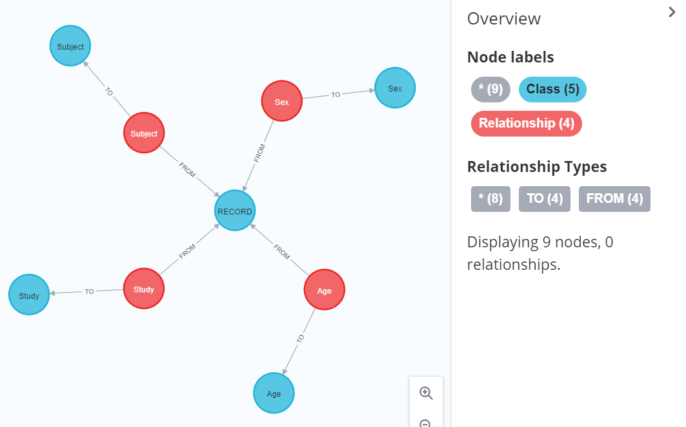
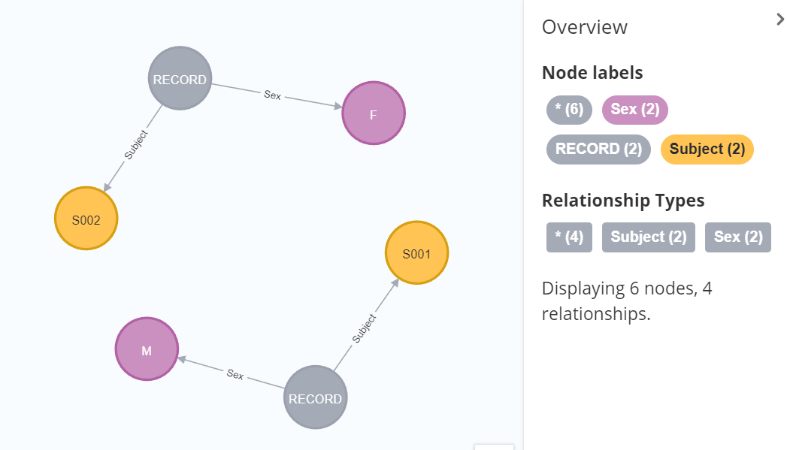

# Class DataProvider(NeoInterface):
   To use the data already in the database (such as the data after the transformations with [ModelApplier](../model_appliers/README.md)),
   for various purposes - such as to feed the User Interface.

   Also for future data transformation, data enrichment, etc.

# Quick start
Given that Neo4j database contains the following metadata nodes:  

    

And the following data nodes:  

 

a call of 
   
    dp = DataProvider()
    dp.dp.get_data_generic(["Subject","RECORD","Sex"],infer_rels=True,return_propname=False) 
    
will return a dataframe
    

             _id_RECORD Sex  _id_Sex  _id_Subject Subject
    0               96   M       91           93    S001
    1               97   F       92           94    S002
where columns 'id.\_Sex_', 'id.\_RECORD_'and 'id.\_Treatment_' would contain unique identifiers of the corresponding nodes in the database (Neo4j node ids) and the rest of the columns will contain values of properties of the corresponding nodes.
    
# Detailed technical description
### __init__()
name | arguments| return
-----| ---------| -------
*__init__*| *args, **kwargs|

---

## DATA RETRIEVAL

### get_data()
name | arguments| return
-----| ---------| -------
*get_data*|  labels: list, rels: list = None, where_map=None, return_nodeid=False |pd.DataFrame

    Assembles into a Pandas dataframe the Property values from all the data nodes with the specified Classes.
    Simplified version of get_data_generic()

    :param labels:         List of strings with Class names.  EXAMPLE: ['Study', 'Site', 'Subject']
    :param where_map:       Used to restrict the data (by default, no restriction.)
                            A dictionary whose keys are Classes to apply restrictions to,
                                and whose values are dictionaries specifying conditions on Property values.
                            An implicit AND is understood among all the clauses.
                            EXAMPLE:
                            {
                                'SUBJECT': {
                                    'USUBJID': '01-001',
                                    'SUBJID': '001',
                                    'PATIENT GROUP': [3, 5]
                                },
                                'SEX': {
                                    'ASEX': 'Male'
                                }
                            }
                            Notes:
                                - The keys in the outer dictionary are expected to be node labels.
                                - The (key/values) in the inner dictionary entries
                                  are meant to be (attribute names : desired values)
                                  that are applicable to the node with their corresponding label.
                                - The values may be various data type, incl. strings, integers and lists.
    :param rels: A list of relationships e.g [{'from':<label1>, 'to':<label2>, 'type':<type>}, ...]
    :param return_nodeid: Boolean
    :return: pd.DataFrame   A Pandas dataframe containing all the (direct and indirect) Property values
                            of the data points from the requested Classes, plus their Neo4j IDs.
                            The Property names are prefixed with the Class names

    *EXAMPLE* - given the data in the image below,
              get_data(['Subject','Record', 'Age']) produces:

                Subject     Age
    0            S001       30        
    1            S002       40      

---
 
---

### get_data_generic()
name | arguments| return
-----| ---------| -------
*get_data_generic*| labels: list, rels: list = None, labels_to_pack=None, infer_rels=False, where_map=None, where_rel_map=None,allow_unrelated_subgraphs: bool = False, use_shortlabel: bool = False, use_rel_labels: bool = True, return_nodeid: bool = True, return_propname: bool = True, return_termorder: bool = False, only_props: list = None, check_schema=False, limit=None, return_q_and_dict=False, pivot: bool = False| pd.DataFrame

    Assembles into a Pandas dataframe the Property values from the data nodes with the specified Classes.
    Use this instead of get_data() when you need a full set of options.

    TODO: it cannot handle different classes with the same property name - it may produce wrong results;
          use prefix_keys_with_label = True in this case

    :param labels:             List of strings.  EXAMPLE: ['Study', 'Site', 'Subject']
    :param rels: A list of relationships e.g [{'from':<label1>, 'to':<label2>, 'type':<type>}, ...]
    :param where_map:           Used to restrict the data (default, no restriction.)
                                A dictionary of dictionaries.  SEE explanation in get_data()
    :param where_rel_map 
    :param allow_unrelated_subgraphs: Boolean
    :param use_short_label: Boolean
    :param use_rel_labels: Boolean
    :param return_nodeid:       Boolean
    :param return_propname: Boolean
    :param return_termorder: Boolean
    :param only_props: list = None
    :param check_schema: Boolean
    :param limit: Either None or an integer
    :param return_q_and_dict: Boolean
    :param pivot: Boolean
    :return: pd.DataFrame(): nodes in path, merged with apoc.map.mergeList and converted to pd.DataFrame()

---

