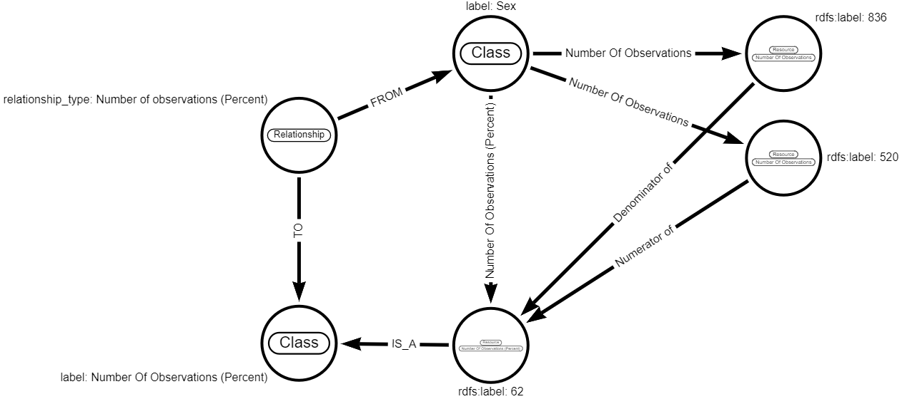

# Derivation Method

DerivationMethod is a Python class to apply derivations using analysis metadata stored in the graph. 
These derivations contain a series of method actions which, when followed by DerivationMethod, provide end-to-end instructions 
for a specific data enrichment. These actions have a broad scope and are detailed further in the Method Action Types section.

For any derivation, DerivationMethod will find the sequence of Method nodes representing actions using the **\[:NEXT]** and 
**\[:METHOD_ACTION]** relationships and apply them consecutively.

- The first method should in most cases be a get_data method action, which creates a dataframe using a query derived from its attached nodes.
- This is optionally followed by a filter method action, which _must_ come after a get_data method action.
- Then comes a sequence of other method actions, which must end in a method action type that applies changes to the graph. 
- The currently processed dataframe is accessible to and returned by each Method throughout the derviation method.

All Methods (as stored in metadata) must have an unique 'id'. DerivationMethods ids (i.e. if property of root Method node) 
must also be the name of the file (e.g. id: 'derive_trtsdtm_001' and the filename 'derive_trtsdtm_001.json'). 
Uniqueness of the id _must_ be true within the method definition (within 1 json/ttl file). 

As soon as a Method gets imported in a study, all ids of "child"-nodes get prefixed with parent id automatically. 
The DerivationMethod id gets prefixed with STUDYID. 

All example methods can be found in this folder as json files and can be pasted directly into arrows.app for viewing.

## Running a derivation

To run one of the derivations, you need to create an instance of the DataProvider python class
that is linked to a database. This database needs to have been setup with data that has been loaded and reshaped (see data_loaders, gsk/cdisc_model_managers, 
model_appliers).

The derivation_method_factory can then be used to load the derivation into the graph, using the created database interface class, and applied
 as follows:

```
# load method
method = derivation_method_factory(data=LOCAL_JSON_PATH / METHOD_JSON,
                                   interface=interface,
                                   overwrite_db=True)

# apply all method actions in loop
df = None
for action in method.actions:
    df = action.apply(df)
```

Alternatively once loaded, the method can be accessed using the OnlineDerivationMethod() class ensuring the name parameter 
matches the name of the loaded derivation. The derivation can then be applied using OnlineDerivationMethod.apply().

An example derivation and script can be found in the derivation_method/examples folder. The `apply_derivation_method.py` script runs the derivation, `test_data.csv` contains a small set of data for the derivation, `load_data.py` has a function for loading this data/setting up the schema and `example_derivation_method.json` contains the derivation method itself. An image of this derivation method is included below:


## Python class Method 

This class is the super class of DerivationMethod.

The Method class performs a cypher match for a specific method node and returns attached method nodes that represent 
method actions using **\[:METHOD_ACTION]** and **\[:NEXT]** relationships. The properties of these collected nodes, represented as 
dictionaries, are then used to initialise a list of Action subclasses or SuperMethods, detailed further in the Method 
Action Types section.

## Python class Action

The Action class is the super class of all the method action Types.

All Actions contain the following functions:
- fetch_metadata(): Performs specialised cypher queries to establish the method action's metadata (or configuration) from its 
connected nodes, relationships and their properties.
- apply(): Performs action specific tasks that manipulate the methods self.df

Only Actions that apply changes to the graph inherit from the AppliesChanges Action subclass. These actions also
include the following alongside fetch_metadata() and apply():
- rollback(): Reverses graph modifications that were performed during the methods apply()

# Action Types

## Action Type: GetData & Filter

GetData method actions retrieve data through calls to DataProvider.get_data_generic using labels, relationships and where maps
obtained during the method action's _fetch_metadata(). Label and relationship metadata is located by traversing from a GetData 
method action node to classes through **\[:SOURCE_CLASS]** and **\[:SOURCE_RELATIONSHIP]** relationships. Where maps however are obtained
from a subsequent filter method action nodes by traversing through **\[:ON]**, **\[:ON_VALUE]** and **\[:FILTER_RELATIONSHIP]** relationships.

The result of this get_data_generic call will be delivered as a pandas dataframe in the following format:

- Columns for each class named using the class.short_label property containing the RDFSLABEL property of matched data 
of this class.
- ID columns for each class named class.short_label prefixed with \_id_ containing Neo4j node ids of the corresponding 
data used for further processing.

See the DataProvider documentation for more information on get_data_generic, where maps and optional relationships.

If Allow Disconnected Subgraphs is enabled on a get data action, the resulting dataframe will be a 
cartesian product between disconnected graph patterns.

#### Example 1 - Getdata source classes


This example is sourcing data through **\[:SOURCE_CLASS]** relationships to classes and has 
no filters or optional relationships. This would result in a get_data_generic call with the following arguments:

- Labels: \[Subject, Disposition, Standardized Disposition Term]
- Rels: []
- Where map: []
- Where rel map: []

#### Example 2 - GetData source relationships


This example is sourcing data through **\[:SOURCE_RELATIONSHIP]** relationships to relationship nodes and finally 
**\[:FROM]** and **\[:TO]** relationships to classes. Notice also this example _has_ an optional relationship and has no 
filters. This would result in a get_data_generic call with the following arguments:

- Labels: \[]
- Rels: \[<br>{from: Disposition, to: Subject, type: Subject, optional: NULL},<br>
{from: Disposition, to: Standardized Disposition Term, type: Standardized Disposition Term, optional: true}<br>]
- Where map: []
- Where rel map: None

#### Example 3 - GetData source relationships with single class filter


This example is sourcing data through **\[:SOURCE_RELATIONSHIP]** relationships to classes but also has
a following filter node. This would result in a get_data_generic call with the following arguments:

- Labels: \[]
- Rels: \[<br>{from: Demographics, to: Subject, type: Subject, optional: NULL},<br>
{from: Demographics, to: Age, type: Age, optional: NULL}<br>]
- Where map: {'Age': {'rdfs:label': 51}}
- Where rel map: None

This where clause would translate into a query with cypher similar to the following:

```
MATCH ...,
(...)-[... : ...]->(`AGE`)
WHERE `AGE`.`rdfs:label` = 51
```

<hr>

It is also possible to pass multiple terms to the 'filter' method action for each class:


This would result in a get_data_generic call with the following arguments:

- Labels: \[]
- Rels: \[ <br>
{from: Laboratory Test Results, to: Subject, type: Subject, optional: NULL},<br>
{from: Laboratory Test Results, to: Short Name of Measurement, Test or Examination, type: Short Name of Measurement, Test 
or Examination, optional: NULL}<br>]
- Where map: {'Short Name of Measurement, Test or Examination': {'rdfs:label': \['ALP', 'MCV', 'PH']}
- Where rel map: None

and a cypher query similar to:

```
MATCH ...,
(...)-[... : ...]->(test:`Short Name of Measurement, Test or Examination`)
WHERE test.`rdfs:label` in ['ALP', 'MCV', 'PH']
```

### Additional filter examples

#### Range filter


Adding a property **'how: range'** to the **\[:ON]** relationship will apply a range filter onto the connected class. 
In the example, the filter will be ```10 <= VISITNUM < 20``` and ```VISITNUM is not NULL/None/NaN```. The resulting 
get_data_generic call would have the following arguments:

- Labels: \[...]
- Rels: \[...]
- Where map: {'Visit Number': {'rdfs:label': {'how': 'range', 'min': 10.0, 'max': 20.0, 'min_include': True, 'max_include': False, 'incl_null': False}}}
- Where rel map: None

Which would translate into cypher similar to the following:

``` 
MATCH … (vn:\`Visit Number\`) 
WHERE vn.\`rdfs:label\` IS NOT NULL AND (10 <= vn.\`rdfs:label\` < 20) 
```

#### Multiple Classes


A single filter method action can have multiple **\[:ON]** relationships with different classes. This includes multiple term 
filters and range filters. The get_data_generic call for this example would have the following arguments:

- Labels: \[...]
- Rels: \[...]
- Where map: {'Short Name of Measurement, Test or Examination': {'rdfs:label': "ELVEOS"}, 'Evaluation Interval': {'rdfs:label': "-P12M"}
- Where rel map: None

Which would translate into the following cypher where clause:

```
WHERE `Short Name of Measurement, Test or Examination`.`rdfs:label` = "ELEVEOS" AND `Evaluation Intervale`.`rdfs:label` = "-P12M"
```

## Action Type: RunScript


RunScript method actions consist of a single node and are defined by the properties of this node. These method actions convert the 
specified function (named in the **"script"** property) and parameters (from the **"params"** property) into an expression.
The currently processed dataframe from previous method actions, eg GetData, is included in this expression
which is then evaluated by Python eval(). 

Functions are imported using the **"package"** property from the **hardcoded** src.utils.{PACKAGE} location.

In this example the function named **head_tail**, defined in **src.utils.basic_df_ops** would be run.

## Action Type: RunCypher


RunCypher method actions consist of a single node and are defined by the properties of this node. These method actions are a 
flexible option for interacting with the graph in ways not currently achievable through other method action types.

- These actions always return a dataframe
- If the **"include_data"** property is set to **'true'**, the dataframe from previous method action will be accessible 
in the query through the **"$data"** parameter in a ```df.to_dict(orient='records')``` format.
- If the **"update_df"** property is set to **'true'**, the currently processed dataframe from previous method action will be **replaced**
with the result of a RunCypher action.

## Action Type: CallAPI


CallApi method actions are similar to RunScript method actions and consist of a single node and are defined by the properties of this 
node. Instead of running functions locally like RunScript, CallApi method actions send requests to a [REST API](https://github.com/gsk-tech/cldapi) which runs the 
requested function.

- The REST API is capable of running _both_ Python and R scripts using the Reticulate package.
- Similarly to RunScript, API requests are are converted to an expression which is evaluated by Python eval().
- The REST API is capable of loading scripts from a specified GitHub repository/branch/folder combination. 

In this example we are sending a request to the REST API to run:
 - The Python function **head_tail** 
 - From the package **basic_df_ops**
 - In the **gsk-tech/cldnb** repository
 - In the **src/utils** directory
 - With  the parameters defined in the **param** property.

## Action Type: AssignLabel aka (assign_class)


Assign_class method actions create a new label on an already existing node. 

In this example the label **'Baseline Value'** would be assigned to the (previously existing) class **'Height (cm) at Baseline'**. 
A column with the new label is created in the dataframe with the original node ids as this allows any future method actions
(such as link method actions) to reference this new label.

## Action Type: Link

Link method actions in general create relationships between entities of classes as specified in the context of Relationship 
node following the **\[:FROM]** and **\[:TO]** relationships). In this example, entities of class Subject would be linked 
to entities of class Population.

- The type of the link created is specified in the 'relationship_type' property on the Relationship node
- New nodes will be MERGED into the graph if the link how property contains 'merge' **OR** if a **\[:TO_VALUE]** 
relationship exists from the action node, otherwise they will be CREATED.

Links are created between entities (nodes) using their ids which are stored in a dataframe columns labeled **\_id_{short_label}**.
If a link is performed on a column containing data that does not currently exist in the graph, this data will be loaded
into the graph (creating or merging new entities) by [Neointerface load_df()](https://github.com/GSK-Biostatistics/neointerface/blob/main/neointerface/neointerface.py#L1384) 
. An example of this is shown below:

```
COLUMN_NAME = {TO or FROM class.short_label}
ids = load_df(
    df= df[COLUMN_NAME].copy(),
    label={TO or FROM class.label},
    rename={COLUMN_NAME:"rdfs:label"},
    merge={True or False depending on conditions mentioned above},
    primary_key="rdfs:label"
)
```

Links of type "merge_on_uri" or "merge_from_on_uri" perform this load_df() function differently to ensure distinct 
entities are created. The key difference being the use of a **"uri"** as the primary key rather than **"rdfs:label"**.
An example of this is shown below:

```
COLUMN_NAME = {TO or FROM class.short_label}
URI_COLUMN = {"_uri_" + COLUMN_NAME}

ids = load_df(
    df=pd.concat([COLUMN_NAME, URI_COLUMN], axis=1),
    label={TO or FROM class.label},
    rename={COLUMN_NAME: "rdfs:label",
            URI_COLUMN: 'uri'},
    merge={True or False depending on conditions mentioned above},
    primary_key='uri'
)
```

The entity ids returned from load_df() are then appended to the dataframe and used for linking.

#### Pandas NaN handling

Pandas NaN types can interfere with Neo4j because they are not equivalent. Link actions therefore replace 
occurrences of NaN with a special string before performing load_df(). Properties of newly created nodes equal to this 
string are then set to NULL.

#### Link scenarios


There are a number of scenarios where links would be established slightly differently, using the diagram above as a guide:

**Scenario 1: Neither \[:TO_VALUE] not \[:FROM_VALUE] links originate from the method action node**

The dataframe passed into the 'Link' method action must contain columns named '_id_USUBJID' and '_id_POP', each row must 
contain a pair of existing Neo4j node ids of nodes with corresponding labels ('Subject' and 'Population') which are 
supposed to be linked with a relationship.

**Scenario 2: Link \[:TO_VALUE] exists, link \[:FROM_VALUE] does not exist**

The dataframe passed into the 'Link' method action must contain a column named '_id_USUBJID'(see \[:FROM]) containing node ids 
of existing nodes with label 'Subject' which are supposed to be linked with a relationship to nodes labeled 'Population'
(see \[:TO]), but only the nodes with values of property 'rdfs:label' equal to "All Randomized Subjects Population". 
If the node "All Randomized Subjects Population" does not exist - the system would create it and establish a link to it.

**Scenario 3: Link \[:TO_VALUE] does not exist, link \[:FROM_VALUE] exists**

Mirrorwise to scenario 2

**Scenario 4: Both links \[:TO_VALUE] and \[:FROM_VALUE] exist**

If there is at least 1 record in the dataframe passed into the 'Link' method action a link will be created between the entities 
of the specified classes on the specified values. Note: it does not make sense to pass more than 1 record into the method action 
in this scenario as the same operation would repeat for each row.

#### Link example - merge


The dataframe passed into the Link method action must contain a column named '_id_VISIT' (see \[:FROM]) containing node ids 
of existing nodes with label 'Visit Name' which are to be linked with a relationship labeled 'Condition'(see \[:TO]).

The dataframe must also contain a column named 'COND' (see Class.short_label), this column must contain the values of 
the nodes with label 'Condition' to be created with load_df() and linked to. The values in the 'COND' column must be either
'Scheduled Visit' or 'Unscheduled Visit' (see ( :Term.rdfs:label) that are linked to (:Class) ). 

The Link action will create distinct nodes with label 'Condition' (only 2 nodes will be created) and link 'Visit Name' 
nodes to these new nodes 'Condition' using the ID columns according to them being in the same row of the dataframe. An
example of link creation cypher is shown below:

```
MATCH (from), (to)
WHERE id(from) = $from_id and id(to) = $to_id
MERGE (from)-[:{self.rel_type}]->(to) 
```

## Action Type: LinkStat


LinkStat actions are a parallel of the Link action specifically for working with statistics. It is important to note that
these actions **are not** represented in method json or the graph (see ApplyStatSuperMethod).

Unlike Link, these actions consist of a _single node_ and _do not_ use fetch_metadata() to determine their meta. They are 
instead initialised with the their meta directly using the **dont_fetch=True** argument.

Using the example above, LinkStat method actions work as follows:

- LinkStat method actions do not use load_df() and instead MERGE new entitites directly.
- New entities are created with the labels "Resource" and the Label of the statistic they represent, in this case
a Median Value. The rdfs:label property of this new entity is the statistic value. 
- Link stat then creates Relationships (Links) from the Result(s) and Dimension(s) to the created entities with the
relationship type being the label of the statistic, in this case Median Value.

## Action Type: BuildUri


BuildUri actions create a new uri column(s) for each **FOR** class by combining the _values_ in **BY** column(s) for a each
row in a dataframe.

- The currently processed dataframe must include all **BY** columns before building a URI
- URIs can be optionally prepended with a prefix with the **prefix** property.
- The URI can be further extended by including a **\[:URI_LABEL]** relationship to a class.

In this example imagining our initial dataframe is as follows:

|Column 1|Column 2|Column 3|
|:-------|:-------|:-------|
|C1-A|C2-A|C3-A|
|C1-B|C2-B|C3-B|
|C1-B|C2-B|C3-B|

The following column would be created:

|Column 1|Column 2|Column 3|\_uri_Column 1|
|:-------|:-------|:-------|:-------------|
|C1-A|C2-A|C3-A|example_Column 1_by_/C2-A_label_Column 3|
|C1-B|C2-B|C3-B|example_Column 1_by_/C2-B_label_Column 3|
|C1-B|C2-B|C3-B|example_Column 1_by_/C2-C_label_Column 3|

Where the uri follows the format: ```{prefix}_{for}_by_/{by_value1}/..._label_/{uri_label1}/...``` repeating by_values 
and uri_labels as required.

## Action Type: BranchAction


The BranchAction has several subclasses used for Saving, Loading or Combining dataframes during a derivation.

#### BranchSave

Saves a dataframe to a dictionary of branches in the format key: action_id, value: self.df.copy(),

In this example, the value of the first branch save would be a copy of the df result from the preceding get_data action with the 
key branch_save1. Similarly the value of the second branch save would be a copy of the df resulting from the preceding run_script
action with the key branch_save2.

#### BranchLoad

Loads a dataframe from the branch_dfs dictionary using the method id as the key

#### BranchCombine

Uses **\[:METHOD_BRANCH]** relationship(s) to obtain the ids of saved branches to load saved dataframes and combines them 
using Pandas merge. This merge is performed ON columns present in both dataframes. 


# Python class SuperMethod

Named SuperMethods, ie those that have a type like apply_stat, represent predefined combinations of method actions. The
individual actions of these SuperMethods are **not** included in the database and they are instead represented by a single node.

#### ApplyStatSuperMethod


The "apply_stat" Super Method is designed specifically for the use case of calculating and storing(linking) specified 
summary statistics of specified values by specified dimensions. This method runs a chain of actions always starting with
BranchSave and then the following sequence for each unique combination of Dimensions specified, having the "required" 
Dimensions always being included in a combination:

- (conditionally) BranchLoad, to restore the initial state of the dataframe if more than one dimension combination is being applied.
- CallAPI, to run the script specified in the **"script"** property of the "apply_stat" Method node, in this case "group_by". 
The parameters for this script being based on the nodes linked to the "apply_stat" Method node with relationships of types 
"Dimnension", "Result", "Statistic" accordingly.
- BuildURI, to prepare the dataframe for linking
- LinkStat, to merge and create relationships to the new statistic values.

Note that as with other named SuperMethods the chained method actions are not included in the database. 

In this example the result is as follows:


This sequence of actions is extended when applying percentages to include:

- Additional CallApi actions for multiplication and division.
- Branch Actions for saving, loading and combining dataframes containing numerators and denominators.
- Link and LinkStat actions for creating and linking numerators, denominators and percentage stats.

A simplified example of a percentage result is shown below:



Further information on the method actions used by apply_stat can be found below.

#### DecodeSuperMethod


Used to "translate" the values of one class into the values of another or for grouping values
together. E.g. Translate class `Sex`(M/F) into `Analysis Sex`(Male/Female) or group class 
`Treatment`(Drug A/ Drug B/Placebo) to class `Treatment Group`(Active/Placebo). 

The format for this super method is simple, with just a from_class and a to_class defined. However the schema for this 
super method (that is required to be set up beforehand) is slightly more complex. There needs to be a relationship node 
(of any type) between the two classes along with a relationship of type SAME_AS between each term being mapped. E.g.


In this example, there are 6 terms from the class `Age Group` that are being mapped/grouped to two terms from the class
`Age Group A`. After running this super method, there will be a new relationship of type `Age Group A` 
(type of rel between the classes) between the terms of `Age Group` and `Age Group A` as in the figure below:


The actions this super method generates are:
   - CallAPI - Runs the `remap_term_values` function found in basic_df_ops
   - Link - Creates the links between the terms

#### SubjectLevelLinkSuperMethod

Used to combine [AssignLabel](#action-type-assignlabel-aka-assignclass) and [Link](#action-type-link) actions that add the required labels and relationships to classes that are defined as *Subject Level*.

The json for such an action would look like:


Where the green relationship and node are optional. They allow a user to select a specific parameter term to link to whereas the default process is to link to the parameter term with the same label as the *Subject Level* class.
The actions included are as follows:
- AssignLabel - where we assign the Analysis Value class label onto *Subject Level* class.
- BuildUri - with format:
    - prefix: Subject_level_{parameter_term}
    - uris for: [RECORD]
    - uris by: [SUBJECT]
    - uris label: []
- Link 1
    - FROM: SUBJECT
    - TO: RECORD
    - Use URI = True
- Link 2
    - FROM: RECORD
    - TO: PARAMETER
    - TO VALUE: Parameter term with rdfs:label that matches *Subject Level* class label (or defined in action metadata)
- Link 3
    - FROM: RECORD
    - TO: AVAL
    - Merge = True