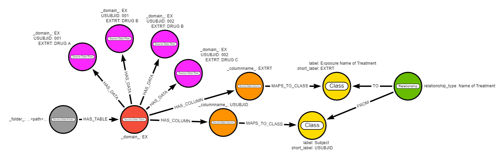
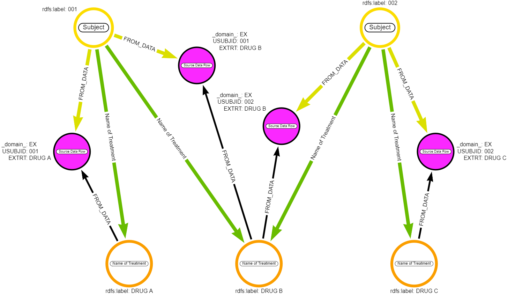
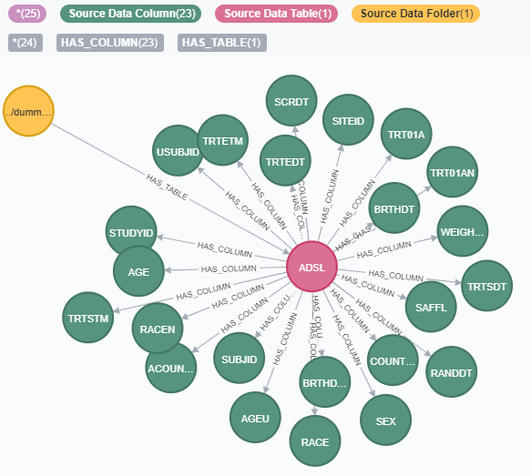
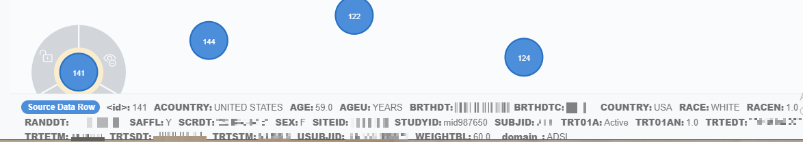
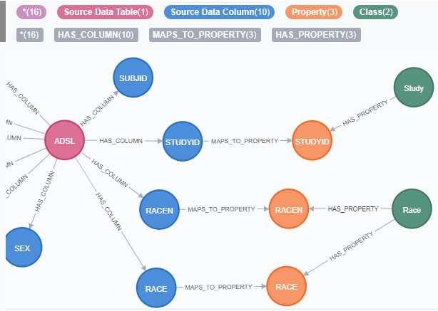
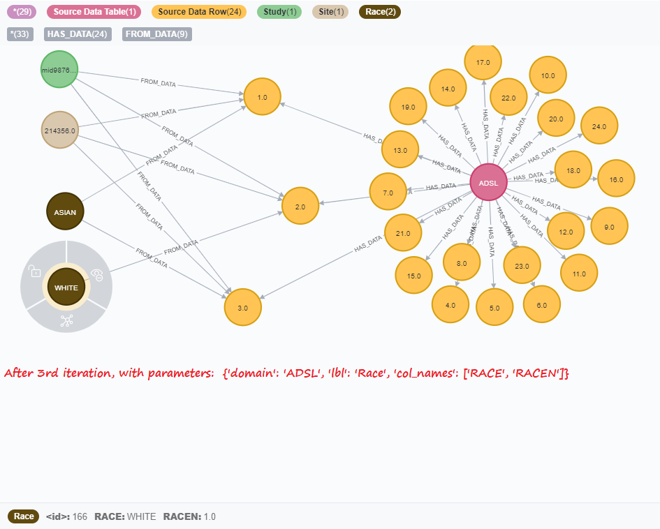
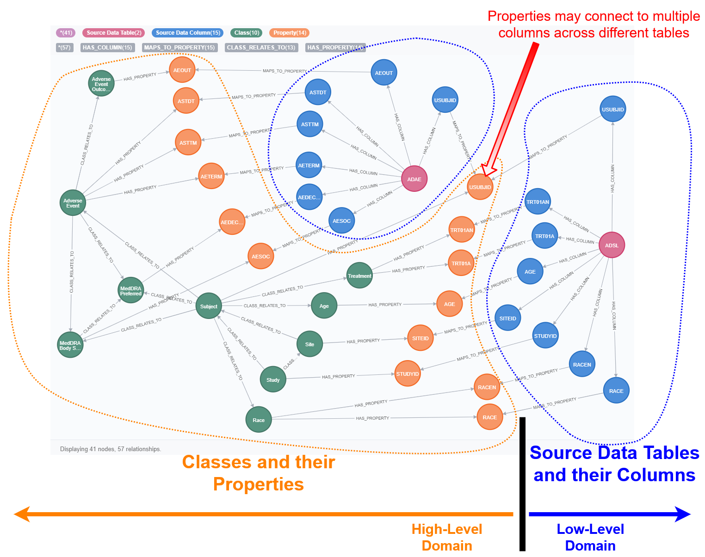
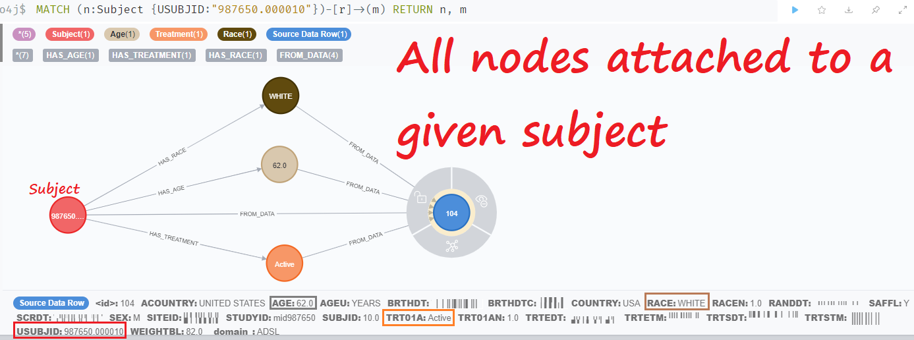

# ModelApplier Class (schema_Class mode)
ModelApplier - Python class to restructure data in Neo4j database using Class-Relationship model 
(which as well resides in Neo4j). 

The best way to describe the main urpose of ModelApplier is to look at what happens when running
[examples/refactor_small_example.py](../examples/refactor_small_example.py)

Before using Method Applier data should be loaded in the database along with its metadata. [DataLoaders](../data_loaders/README.md) 
can be used for that purpose.
The Class-Relationship schema along with mappings of the loaded data metadata
to the schema should be uploaded as well - Model Managers can be used for this.

The refactor_small_example.py file assumes the above have been loaded and loads the prerequisites 
from [examples/data/refactor_small_example.json](../examples/data/refactor_small_example.json)
The example data+metadata is as follows:

After running the script, given the metadata, we would expect the following result:

- 2 nodes with label 'Subject' and `rdfs:label` = '001' and '002' would be created as
(:`Source Data Column`{_columnname_: 'USUBJID'})-[:MAPS_TO_CLASS]->(:Class{label:'Subject'})
- 3 nodes with label 'Name of Treatment' and `rdfs:label` = 'DRUG A', 'DRUG B' and 'DRUG C' would be created as
(:`Source Data Column`{_columnname_: 'EXTRT'})-[:MAPS_TO_CLASS]->(:Class{label:'Name of Treatment'})
- The above nodes would be linked with a [:FROM_DATA] relationship to the `Source Data Row` now from which the data came from
- The node (:Subject) nodes would have relationship [:`Name of Treatment`] to the (:`Name of Treatment`) nodes if they come from the same `Source Data Row` node
since the following path of metadata nodes exists: (:Class{label:'Subject'})<-[:FROM]-(:Relationship{relationship_type:'Name of Treatment'})-[:TO]->(:Class{label:'Name of Treatment'})

# ModelApplier Class (schema_PROPERTY mode - used before 12.2021)
ModelApplier - Class to restructure data in Neo4j database using Class-Property model 
(which as well resides in Neo4j). 

The best way to describe the main purpose of ModelApplier is to look at what happens when running
examples/refactor_adsl_adae.py:  

Before running the refactor_adsl_adae.py file the data needs to be loaded first with examples/load_adsl_adae.py
We get metadata loaded (only ADSL shown):  
  
and data:  
  

Later ModelManager is used to create metadata for re-shaping the data. It ends up with new nodes (Class and Property) appearing in the database. ModelManager as well linkes The Source Data Column nodes to the Property nodes which this column is supposed to be mapped to. (note that only a subset is displayed(Race and Study, there are actually more Classes, Properties and links in the database)  

The core functionality of ModelApplier is the refactor_all method which processes all of the above data to extract entities of the defined classes into separate nodes (see new nodes labeled "Race", "Study", "Site")   

Note that columns from multiple tables may be mapped to the same property. By this we achieve the "auto-join" between tables in the graph:  

In the image above you could notice that some of the metadata (Class) nodes are linked between each other with a "CLASS_RELATES_TO" relationship (now replaced with "<-[:FROM]-(:Relationship)-[:TO]->" - image to be updated) (e.g. Class Subject linked to Classes Race, Age, Treatment and other). ModelApplier uses this metadata to as well link the new (extracted) nodes between each other. See example for Race, Age, Treatment:    
  
New relationships (Subject)-[:HAS_RACE]->(Race), (Subject)-[:HAS_AGE]->(Age), (Subject)-[:HAS_TREATMENT]->(Treatment) were created. 

To investigate the process in more detail, run step by step examples/load_adsl_adae.py and then examples/refactor_adsl_adae.py Those are processing dummy clinical data supplied with the repository (see dummy_data folder). The original source of the dummy data is gsk_table R package repository.